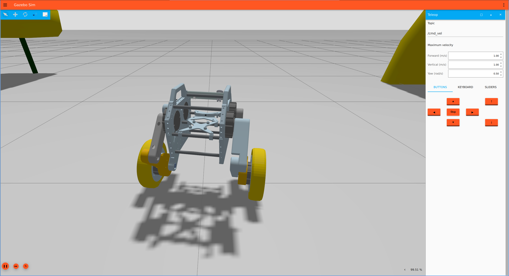
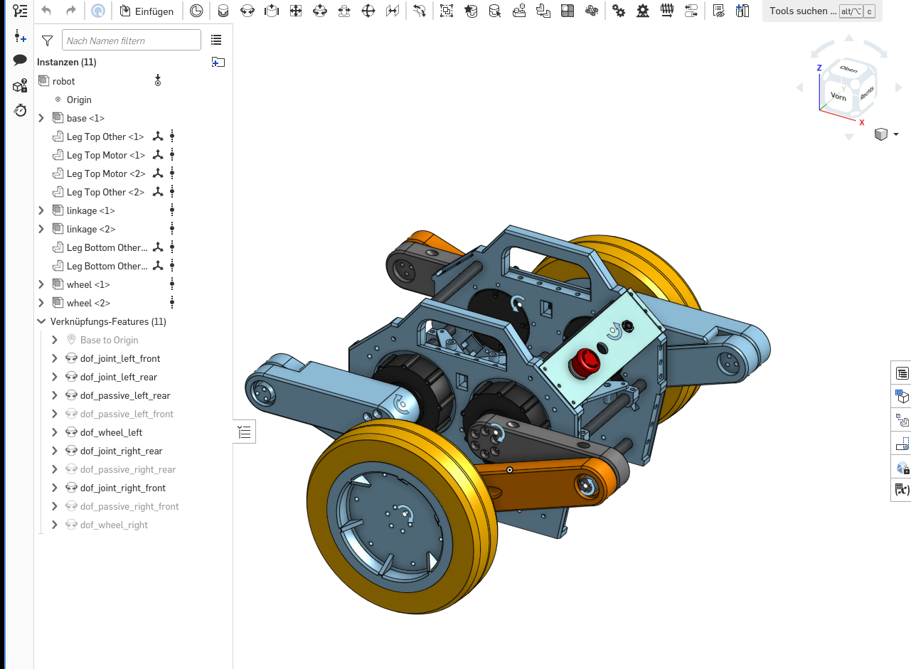

# CyberBot ROS2

[](https://opensource.org/licenses/MIT)
[](https://github.com/cybergear-robotics/ros2-cyberbot/activity)
[](https://docs.ros.org/en/jazzy/index.html)
[](https://gazebosim.org/docs/harmonic/install/)

This repository provides the integration of the Cyberbot in ROS2. In contains a 
custom controller for ros2_controll controller, which balances the robot. Furthermore,
the robot is simulated in Gazebo Harmonic.


# Gazebo

In order to start the simulation, following commands needs to be executed:
```bash
colcon build
source install/local_setup.bash
ros2 launch cyberbot_gazebo gazebo.launch.py rviz:=true
```

# SDF-Format

The robot description is stored in SDF-format, which is transformed into URDF by the `robot_state_publisher`.
More information about that in [`sdfformat_urdf`](https://github.com/ros/sdformat_urdf/tree/rolling/sdformat_urdf).

## Auto-generating robot description

The robot is designed in onshape and the tool [`onshape-to-robot`](https://onshape-to-robot.readthedocs.io/en/latest/index.html) is
used in order to automatically generate the `robot.sdf` file. The generated file needs to be extended by further XML blocks:

* `<ros2_control>` is embeeded in the `<model>` node. It starts the `cyberbot_controller` which provides the joint states.
* `<sensor name="imu_sensor" type="imu">` is embedded in the `<link name="base">`, which let Gazebo provides the IMU topic.

# Kinematic Loop
Each wheel of the robot are connected to the base of the robot by a 5 linkage bar. This results in a kinematic loop, which seems to be
not supported by Gazebo Harmonic and the SDF format. I solved it by keeping the joint next to the wheel unclosed. All positions of joints are
then calculated and provided by the  `cyberbot_controller`. But in general, the `onshape-to-robot` provides support for 
[kinematic loops](https://onshape-to-robot.readthedocs.io/en/latest/kinematic_loops.html).

# State of the work





